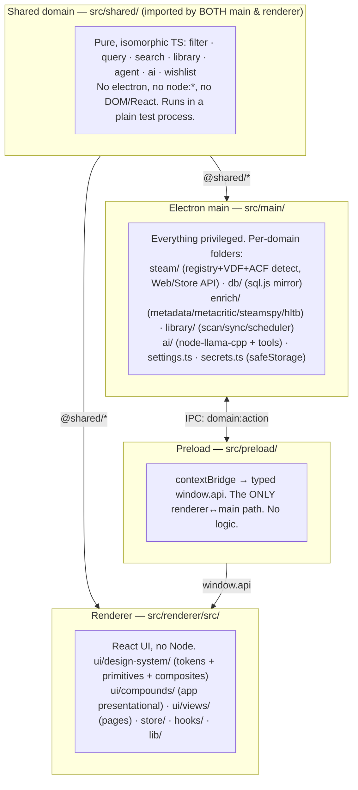

# Architecture — Zones, Boundaries & Where Code Goes

The map for keeping this project structured: the zones, the dependency invariants
that must hold, and a placement guide for new code. Every feature is analyzed against
this before code is written (see the `architecture` skill).

Companion docs: @docs/contributing/design-system.md (UI tiers), @docs/contributing/coding-standards.md (file
rules), and the `refactoring-guru` skill (patterns/smells). Electron/IPC specifics:
the `electron` skill.

## Zones

Aliases: `@shared/*` → `src/shared/`, `@/*` → `src/renderer/src/`,
`@ds/*` → `src/renderer/src/ui/design-system/*`, `@ui/*` → `src/renderer/src/ui/*`.

## Dependency invariants

1. **`src/shared/*` is the leaf.** It is imported by *both* main (Node) and renderer
   (browser), so it must be pure isomorphic TS: no `electron`, no `node:*`, no DOM,
   no React, no `window`. It must run in a plain test process.
2. **The renderer (`@/*`) never imports `src/main/*` or `electron`.** It reaches main
   **only** through `window.api`. It may import `@shared/*`.
3. **Main never imports renderer code (`@/*`) or React.** It may import `@shared/*`.
4. **All privileged work lives in `src/main` only**: fs, the Windows registry,
   Web/Store API HTTP, the sql.js mirror, `node-llama-cpp` inference, `safeStorage`
   secrets, windows, and custom protocols. Native/WASM deps are never imported in the
   renderer.
5. **The preload is the only bridge.** No business logic in preload — it just maps
   `window.api.<domain>.<action>` to a named IPC channel.
6. **Bare UI tiers** (primitive / composite / compound) cannot import stores or
   `window.api`. Data flows in via props; **Views** do the wiring. See
   @docs/contributing/design-system.md.
7. **`ui/design-system/*` is domain-agnostic.** It holds tokens + primitives +
   composites only — it never imports from `ui/compounds/*` or `ui/views/*`. Compounds
   import `@ds/*`; views compose compounds + the design system. Raw HTML (lowercase
   JSX) is allowed **only** inside `primitives/`.

If a change would break an invariant, the code is in the wrong zone. Re-place it.

## Placement guide — "I'm adding X, where does it go?"

| The new code… | Goes in | Notes |
|----------------|---------|-------|
| Needs Node/OS/fs/registry, Web/Store API HTTP, windows, protocols | `src/main/<domain>/` behind a `domain:action` IPC handler | Add the channel to `preload/index.ts` + `global.d.ts`. Use the `electron` skill. |
| Reads/writes the SQLite mirror | `src/main/db/` | sql.js; call `persist()` after writes. |
| Fetches/normalizes external metadata | `src/main/enrich/` | One module per source; respect the Store-API throttle. |
| Local AI inference / a new agent tool | `src/main/ai/` (tools in `ai/tools/`) | `node-llama-cpp`; main only. |
| A secret (Steam key, AI credential) | `src/main/secrets.ts` | `safeStorage`; never logged or committed. |
| Pure rule/type shared by main + renderer | `src/shared/` | Must stay pure & isomorphic + testable. |
| Generic UI atom (Button, Select, Box, Text) | `renderer/src/ui/design-system/primitives/` | presentational, no data; the one place raw HTML is allowed |
| Generic structural combo (Card, Dialog, FilterPanel, QueryBuilder) | `renderer/src/ui/design-system/composites/` | presentational, no data, domain-agnostic |
| App-specific presentational unit (GameCard, LibraryFilters) | `renderer/src/ui/compounds/` | specializes a composite or lays out a domain shape; fetches nothing |
| Child used by exactly one component | that component's `sub-components/` | promote to a tier only on a 2nd consumer (Rule of Two) |
| Page / tab content with logic + data | `renderer/src/ui/views/` | owns stores/`window.api`; logic in `behavior/` |
| A design token (color/space/size/radius/…) | `renderer/src/ui/design-system/tokens/<concept>.css` | add the token first, then use `var(--token)` |
| Renderer UI state | `renderer/src/store/` | Zustand |
| Shared renderer hook | `renderer/src/hooks/` | non-feature-specific |
| Pure renderer helper | `renderer/src/lib/` | no side effects, no `window.api` |

## The rule: analyze before building

Before writing a feature, run the architecture analysis (the `architecture` skill):

1. Decompose the feature into pieces: UI, renderer state, shared domain logic/types,
   privileged IO, the IPC channel that connects them.
2. Place each piece via the guide above.
3. Verify the dependency invariants hold for every placement.
4. Run a pattern pass (`refactoring-guru`) and name the pattern(s) each piece uses.
5. Emit the plan per the `coding-standards` skill (plan format), with a CRUD filetree, the data model in TS, and the flow.

No feature work starts without this analysis and a plan.
